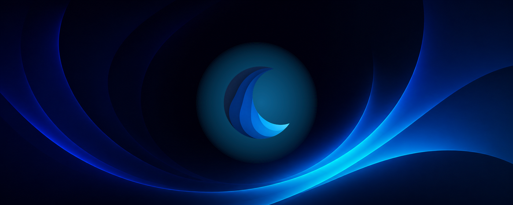
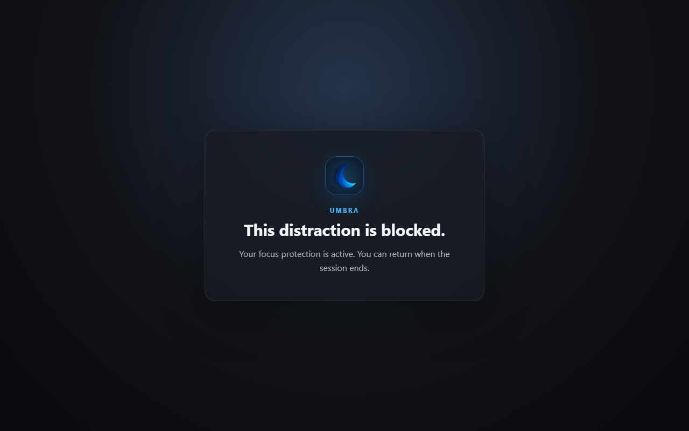
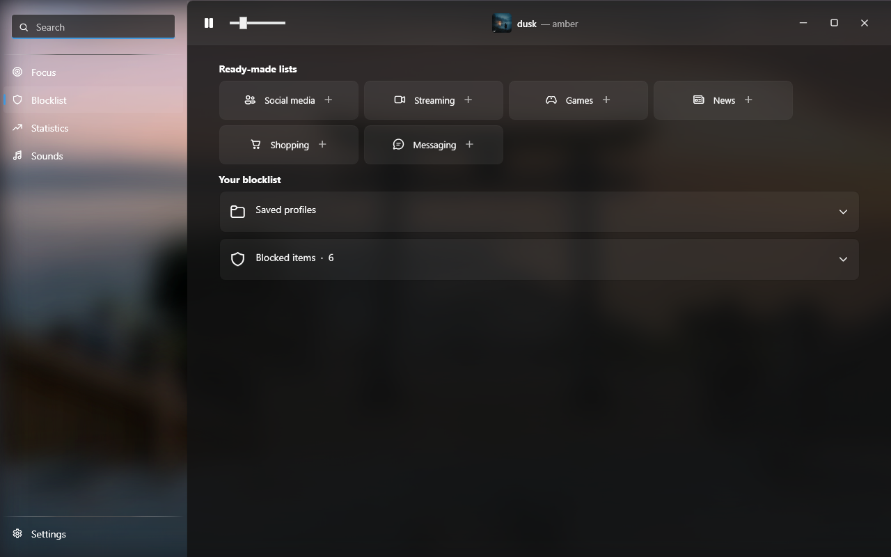
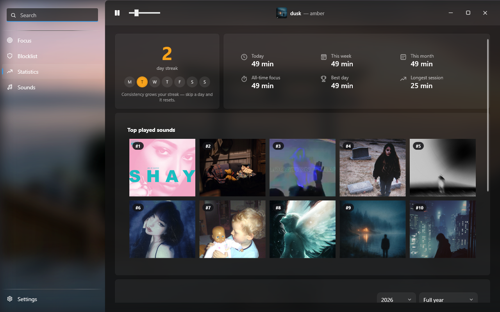
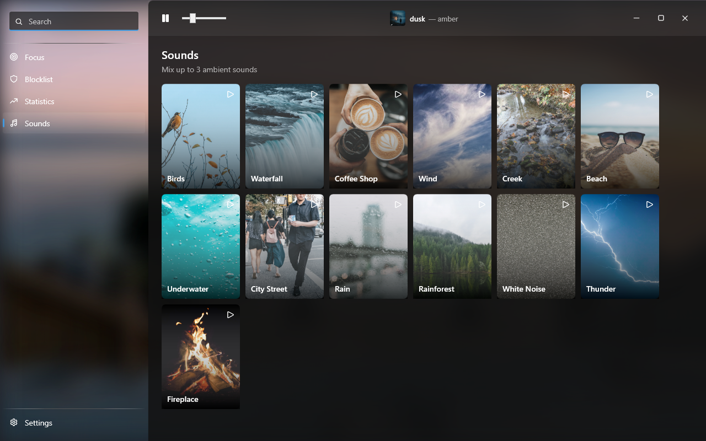
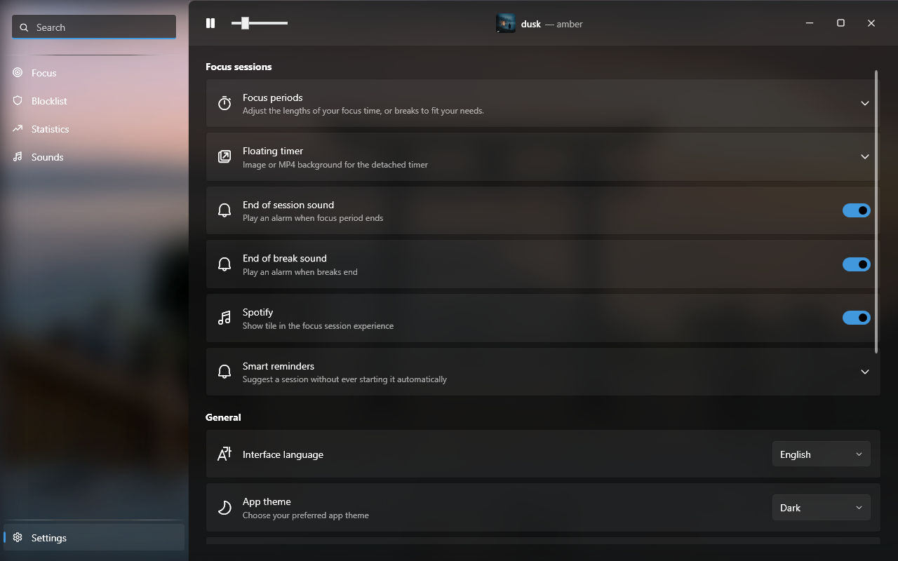

# Umbra

Umbra is a native Windows focus app combining Pomodoro and free-form sessions,
schedules, application and website blocklists, ambient sounds, Spotify media
information, statistics, and a detachable always-on-top timer.

<p align="center">
  
</p>

## Preview

<p align="center">
  <a href="store-assets/screenshots/01-blocked-site.png"></a>
</p>

<p align="center">
  <a href="store-assets/screenshots/02-blocklists.png"></a>
  <a href="store-assets/screenshots/03-statistics.png"></a>
</p>

<p align="center">
  <a href="store-assets/screenshots/04-sounds.png"></a>
  <a href="store-assets/screenshots/05-settings.png"></a>
</p>

## Install on Windows

1. Open the [latest release](https://github.com/huosh1/umbra/releases/latest).
2. Download `Umbra-Setup-<version>-x64.exe`.
3. Run the installer and launch Umbra from the Start menu.
4. In **Settings > Umbra browser extension**, open the Chrome Web Store page
   and install the extension.

Umbra supports 64-bit Windows 10 version 2004 or newer and Windows 11. The
installer is self-contained, so the .NET SDK or runtime is not required.

Until the Chrome Web Store listing is public, testers can download
`Umbra-Extension-<version>.zip` from the same release, extract it, enable
Developer mode in `chrome://extensions`, and choose **Load unpacked**.

> The current installer is not Authenticode-signed. Windows SmartScreen may
> therefore show an “Unknown publisher” warning. Release checksums are included
> in `SHA256SUMS.txt`.

## Main features

- Pomodoro, free, and scheduled focus sessions
- Optional hard mode backed by a watchdog process
- Application blocklists and reusable profiles
- Website blocking through the Manifest V3 browser extension
- Mix up to three ambient sounds
- Spotify/Windows media information in the focus experience
- Focus history, activity calendar, streaks, and top played sounds
- Resizable, draggable, always-on-top floating timer
- French and English interface

## Browser support

The native bridge is registered automatically for Chrome, Vivaldi, Microsoft
Edge, and Brave. It accepts both the official Chrome Web Store extension
(`kihnnccjkhgjagaoljepcpghmfdpicoc`) and the manually installed package
(`ijgalicomdmmcjecigefpchbdeiadnld`).

The extension only sends a matched blocked domain to the local Umbra process.
It does not send browsing data to an Umbra server. See [PRIVACY.md](PRIVACY.md).

## Data location

Umbra stores settings and history locally in:

```text
%APPDATA%\UmbraNative\data
```

Uninstalling the application preserves this directory so an upgrade or
reinstall does not erase statistics. It can be deleted manually when Umbra is
not running.

## Build from source

Requirements:

- Windows 10/11
- .NET 10 SDK
- Inno Setup 6 for the installer

```powershell
dotnet build Umbra.slnx -c Release -p:Platform=AnyCPU
dotnet test Umbra.Tests/Umbra.Tests.csproj -c Release -p:Platform=AnyCPU
./scripts/build-release.ps1 -Version 1.0.0
```

Build outputs are written to `artifacts/`.

## Media

Redistributable ambient sounds and their attributions are documented in
[THIRD_PARTY_NOTICES.md](THIRD_PARTY_NOTICES.md). Animated MP4 wallpaper
presets are intentionally not distributed; users can select their own image or
video in Settings.

## Security

Please report vulnerabilities according to [SECURITY.md](SECURITY.md), not in a
public issue.
