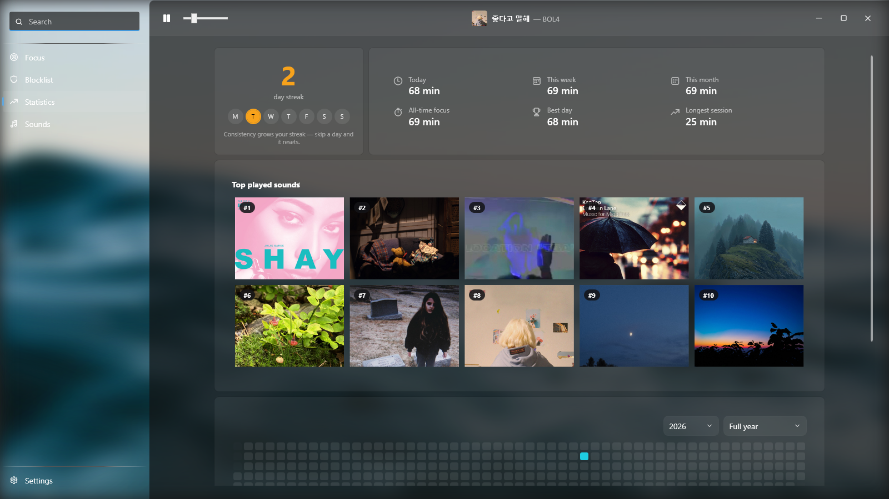
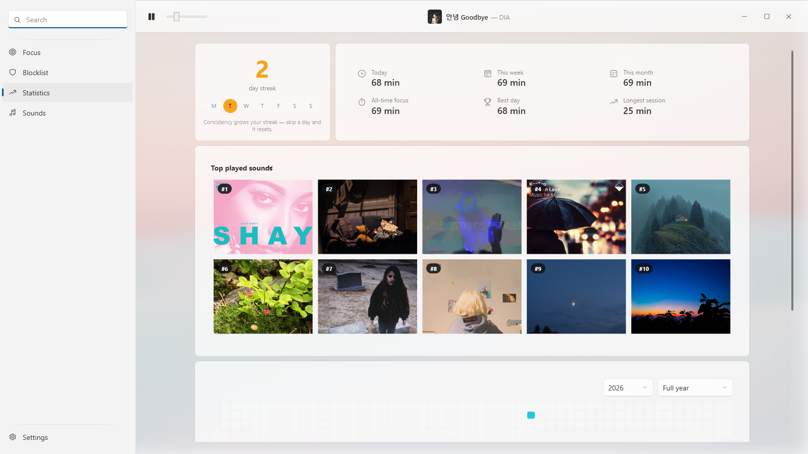
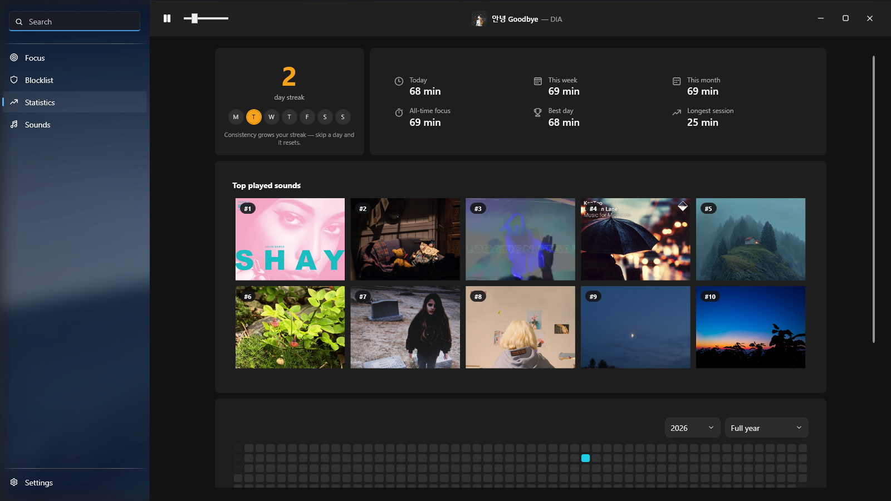

# Umbra

<p align="center">
  
</p>

<p align="center">
  <strong>A native Windows focus space for sessions, blocklists, soundscapes and meaningful statistics.</strong>
</p>

<p align="center">
  <a href="https://github.com/huosh1/umbra/releases/latest"></a>
  
  
</p>

Umbra combines Pomodoro and free-form focus sessions, schedules, application
and website blocklists, ambient sounds, Windows media information, statistics,
and a resizable always-on-top timer in one customizable desktop app.

## Install Umbra

1. Open the **[latest Umbra release](https://github.com/huosh1/umbra/releases/latest)**.
2. Under **Assets**, download `Umbra-Setup-<version>-x64.exe`.
3. Run the installer, then open Umbra from the Start menu.
4. To block websites, open **Settings > Umbra browser extension** and install
   Umbra Blocker from the Chrome Web Store when the listing is available.

Umbra supports 64-bit Windows 10 version 2004 or newer and Windows 11. The
installer is self-contained: the .NET SDK and runtime are not required.

> [!NOTE]
> The installer is not Authenticode-signed yet. Windows SmartScreen can display
> an **Unknown publisher** warning. Every release includes `SHA256SUMS.txt` so
> the downloaded files can be verified.

<details>
<summary><strong>Install the browser extension manually</strong></summary>

1. Download `Umbra-Extension-<version>.zip` from the latest release.
2. Extract the ZIP to a permanent folder.
3. Open `chrome://extensions` in Chrome, Vivaldi, Edge, or Brave.
4. Enable **Developer mode**, choose **Load unpacked**, and select the extracted
   extension folder.

</details>

## Statistics in every style

The entire interface can use a custom background, keep the navigation pane
solid, or limit the background to the navigation pane. Light and dark themes
remain available with every layout.

### Background across the whole interface

<p align="center">
  <a href="docs/screenshots/statistics-dark-water.png"></a>
</p>

### Main background with a solid sidebar

<p align="center">
  <a href="docs/screenshots/statistics-rosy-solid-sidebar.png"></a>
</p>

### Sidebar background with a solid workspace

<p align="center">
  <a href="docs/screenshots/statistics-sand-sidebar.png"></a>
</p>

## More of Umbra

<p align="center">
  <a href="store-assets/screenshots/02-blocklists.png"></a>
  <a href="store-assets/screenshots/04-sounds.png"></a>
</p>

<p align="center">
  <a href="store-assets/screenshots/05-settings.png"></a>
  <a href="store-assets/screenshots/01-blocked-site.png"></a>
</p>

## Main features

- Pomodoro, free, and scheduled focus sessions
- Optional hard mode backed by a watchdog process
- Application blocklists and reusable profiles
- Website blocking through the Manifest V3 browser extension
- Mix up to three ambient sounds
- Spotify and Windows media information in the focus experience
- Focus history, activity calendar, streaks, and top played sounds
- Resizable, draggable, always-on-top floating timer
- Three customizable background layouts
- French and English interface

## Browser support

The native bridge is registered automatically for Chrome, Vivaldi, Microsoft
Edge, and Brave. It accepts both the official Chrome Web Store extension
(`kihnnccjkhgjagaoljepcpghmfdpicoc`) and the manually installed package
(`ijgalicomdmmcjecigefpchbdeiadnld`).

The extension only sends a matched blocked domain to the local Umbra process.
It does not send browsing data to an Umbra server. See [PRIVACY.md](PRIVACY.md).

## Data location

Umbra stores settings and history locally in:

```text
%APPDATA%\UmbraNative\data
```

Uninstalling the application preserves this directory so an upgrade or
reinstall does not erase statistics. It can be deleted manually when Umbra is
not running.

## Build from source

Requirements:

- Windows 10 or 11
- .NET 10 SDK
- Inno Setup 6 for the installer

```powershell
dotnet build Umbra.App/Umbra.App.csproj -c Release
dotnet test Umbra.Tests/Umbra.Tests.csproj -c Release -p:Platform=AnyCPU
./scripts/build-release.ps1 -Version 1.0.2
```

Build outputs are written to `artifacts/`.

## Media

Redistributable ambient sounds and their attributions are documented in
[THIRD_PARTY_NOTICES.md](THIRD_PARTY_NOTICES.md). Animated MP4 wallpaper
presets are intentionally not distributed; users can select their own image or
video in Settings.

## Security

Please report vulnerabilities according to [SECURITY.md](SECURITY.md), not in a
public issue.
